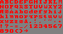

# rune2image

For a given rune, output an image. Only supports a subset of all available characters.

## Example output

The output image from the `cmd/scaled` utility, using this command:

    ./scaled > letters.png

I made this font by hand in 1997, so it's a bit nostalgic to me. It's designed to work well in a resolution of `320x200`.
