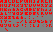

# burnfont

This is a hand-crafted programmatic font, created in 1997. It's a bit nostalgic to me, and was used in my DOS drawing program "Burn":


Here is an image with all available letters:



Notice the oh-so-smooth transparent pixels at the corners of the letters.

The font definition looks like this:

```go
	case 'k':
		plotFontLine("***", x, y, m, r, g, b)
		plotFontLine("-**", x, y+1, m, r, g, b)
		plotFontLine("**-**", x+1, y+2, m, r, g, b)
		plotFontLine("****-", x+1, y+3, m, r, g, b)
		plotFontLine("-**-**", x, y+4, m, r, g, b)
		plotFontLine("*** **", x, y+5, m, r, g, b)
```

The `*` is an opaque pixel, while the `-` is a 25% transparent one.

## Go package

This Go package has a slice `Available` that lists all available runes. There is also a 'Draw' function that takes an `*image.RGBA` value, a rune, a position (x and y) and a color (r, g and b) and draws a letter at that position in the image. The letters are 6x6, with the exception of `*`, which is weird.

* The `cmd/scaled` example outputs an image where each "pixel" of the font is 4x4 pixels.
* The `cmd/letters` example outputs an image where each pixel is a pixel.

## Generating an image

The `scaled` utility can be built and run like this:

    cd cmd/scaled
    go build
    ./scaled > letters.png

## General info

License: MIT
Version: 1.0.0
Author: Alexander F. Rødseth &lt;xyproto@archlinux.org&gt;
